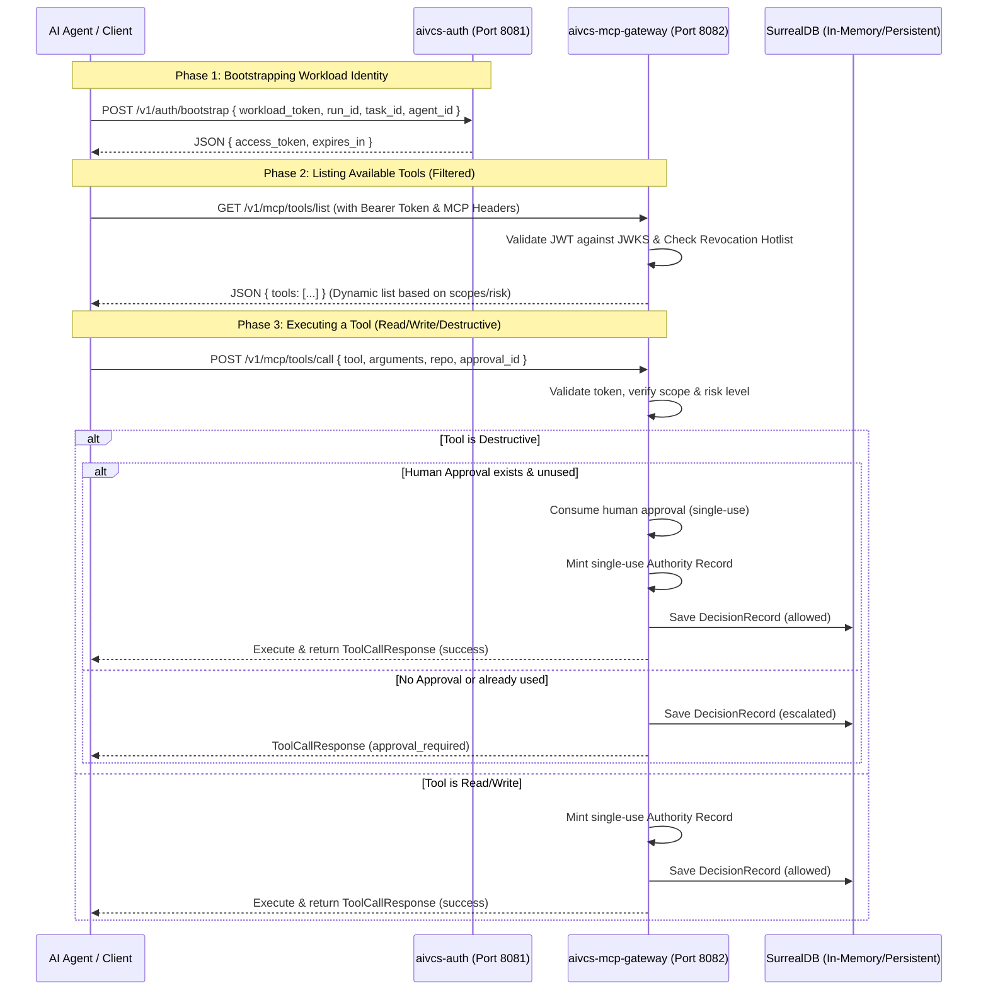

# Zero-Trust MCP Identity and Authentication Model

This guide details the design, architecture, and usage of the Zero-Trust Model-Context Protocol (MCP) Identity and Authentication services built for AIVCS.

---

## 1. Architectural Overview

The security model comprises two core services designed to provide zero-trust execution boundaries for autonomous AI agents performing version control and repository operations:



---

## 2. Core Components

### 1. Workload Identity Bootstrapper (`aivcs-auth`)
Exposes endpoints to exchange workload identity tokens for short-lived, scoped MCP session tokens.
- **Port**: `8081`
- **JWKS Endpoint**: `/.well-known/jwks.json` dynamically publishes the RS256 public key's modulus (`n`) and exponent (`e`) to allow verification of issued tokens.
- **Bootstrap Endpoint**: `POST /v1/auth/bootstrap` exchanges workload identity for JWT.

### 2. MCP Gateway (`aivcs-mcp-gateway`)
Validates incoming session tokens, performs risk and scope evaluations, and registers decisions to SurrealDB.
- **Port**: `8082`
- **Endpoints**:
  - `GET /v1/mcp/tools/list`: Dynamic tool discovery based on JWT claims.
  - `POST /v1/mcp/tools/call`: Executes tool calls with single-use Authority Records and human approval verification.
  - `POST /v1/mcp/approvals`: Registers human approvals (single-use).
  - `POST /v1/mcp/revocation`: Revokes JTIs (JSON Web Token IDs) or session IDs dynamically.

---

## 3. Security Invariants and Guardrails

### A. Dynamic Tool Filtering
Tools are only visible to the agent if they have the corresponding token scopes and their risk level is within the token's allowed `max_risk` limit.

### B. Payload Locking via Digesting
To prevent man-in-the-middle or parameter mutation attacks, human approvals are tied to a canonical payload digest:
$$\text{payload\_digest} = \text{SHA256}(\text{tool} + \text{canonical JSON arguments})$$
Any difference in tool arguments will invalidate the approval.

### C. Single-Use Invariants
1. **Human Approvals**: Once used for a tool execution, a human approval is immediately marked as `used` and cannot be replayed.
2. **Authority Records**: Gateway mints a short-lived, single-use `AuthorityRecord` for every successful execution, proving authorization.

### D. Token & Session Revocation
The gateway maintains a hotlist of revoked token IDs (`jti`) and session IDs. Attempts to access tools using revoked credentials return `401 Unauthorized`.

---

## 4. Run & Test Instructions

### Running the Services Locally
To start the services, run the following commands:
```bash
# Start the Authentication service
cargo run -p aivcs-auth

# Start the MCP Gateway service
cargo run -p aivcs-mcp-gateway
```

### Running Tests
Execute the comprehensive test suites:
```bash
# Run Gateway-specific tests (Zero-Trust, approvals, risk-escalation, revocation)
cargo test -p aivcs-mcp-gateway

# Run Auth-specific tests (JWKS, Token bootstrapping, validation)
cargo test -p aivcs-auth

# Run all workspace tests
cargo test --workspace
```
