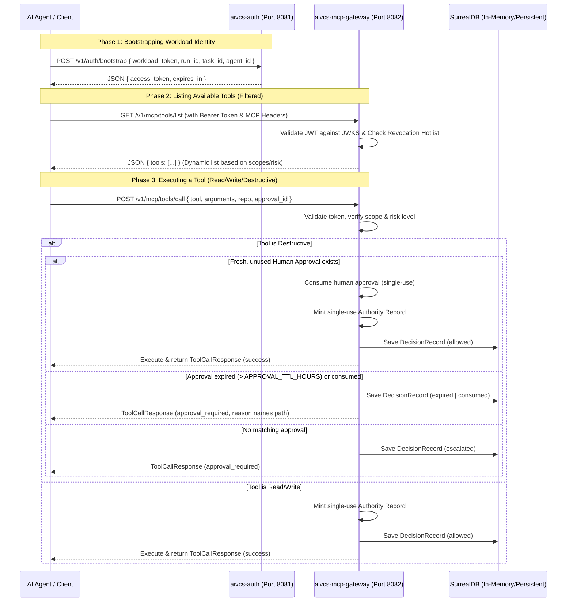

# Zero-Trust MCP Identity and Authentication Model

This guide details the design, architecture, and usage of the Zero-Trust Model-Context Protocol (MCP) Identity and Authentication services built for AIVCS.

**See also**:
- Architecture-of-record: [#227](https://github.com/stevedores-org/aivcs/issues/227)
- Epics & user stories: [#228](https://github.com/stevedores-org/aivcs/issues/228)
- Known Phase-1 gaps tracker: [#239](https://github.com/stevedores-org/aivcs/issues/239)

---

## 1. Architectural Overview

The security model comprises two core services designed to provide zero-trust execution boundaries for autonomous AI agents performing version control and repository operations:



---

## 2. Core Components

### 2.1 Workload Identity Bootstrapper (`aivcs-auth`)
Exposes endpoints to exchange workload identity tokens for short-lived, scoped MCP session tokens.
- **Port**: `8081`
- **JWKS Endpoint**: `/.well-known/jwks.json` dynamically publishes the RS256 public key's modulus (`n`) and exponent (`e`) to allow verification of issued tokens.
- **Bootstrap Endpoint**: `POST /v1/auth/bootstrap` exchanges workload identity for JWT.
- **Issued JWT**: RS256-signed with claims documented in §2.3.

### 2.2 MCP Gateway (`aivcs-mcp-gateway`)
Validates incoming session tokens, performs risk and scope evaluations, and registers decisions to SurrealDB.
- **Port**: `8082`
- **Endpoints**:
  - `GET /v1/mcp/tools/list`: Dynamic tool discovery based on JWT claims.
  - `POST /v1/mcp/tools/call`: Executes tool calls with single-use Authority Records and human approval verification.
  - `POST /v1/mcp/approvals`: Registers human approvals (single-use, TTL-bounded — see §3.C).
  - `POST /v1/mcp/revocation`: Revokes JTIs (JSON Web Token IDs) or session IDs dynamically.

### 2.3 MCP JWT claims reference

Every token minted by `aivcs-auth` and validated by the gateway carries the following claims (see `crates/aivcs-mcp-gateway/src/main.rs` `McpClaims`):

| Claim | Type | Purpose |
|---|---|---|
| `sub` | `String` | Subject — formatted as `"agent_instance:{uuid}"` to bind the token to a specific runtime instance. |
| `aud` | `String` | Audience. Gateway requires `"https://mcp.aivcs.lornu.ai"` (currently hardcoded). |
| `tenant_id` | `String` | Tenant the run belongs to. Propagates into `AuthorityRecord`. |
| `workspace_id` | `String` | Workspace within the tenant. |
| `agent_id` | `String` | Stable logical agent identity (`AgentPrincipal` in #228 terminology). |
| `run_id` | `String` | Run that authorised this token; matched against approvals. |
| `task_id` | `String` | Task within the run; matched against approvals. |
| `scopes` | `Vec<String>` | Granted capabilities, e.g. `repo.diff.read`, `repo.merge.execute`. Gateway gates each `tools/call` on `scope ∈ scopes`. |
| `max_risk` | `String` | Maximum tool risk the token may invoke (`read` / `write` / `destructive`). Tools above this are filtered out of `tools/list` and denied at `tools/call`. |
| `delegated_by` | `String` | Policy / human delegation that minted this token (e.g. `policy:builder-feature-branch-write`). |
| `jti` | `String` | JWT ID — primary key on the revocation hotlist (see §3.D). |
| `exp` | `usize` | Unix-seconds expiry. `aivcs-auth` mints tokens with a 10-minute TTL. |

---

## 3. Security Invariants and Guardrails

### A. Dynamic Tool Filtering
Tools are only visible to the agent if they have the corresponding token scopes and their risk level is within the token's allowed `max_risk` limit. A `tools/call` for a tool whose `risk_level` exceeds `max_risk` returns `200 OK` with `{"status":"denied","reason":"Tool risk level exceeds maximum allowed risk level"}` — see §4 for the full error catalog.

### B. Payload Locking via Digesting
To prevent man-in-the-middle or parameter mutation attacks, human approvals are tied to a canonical payload digest:

```
payload_digest = SHA256( tool.as_bytes() || serde_json::to_string(arguments).as_bytes() )
```

Any difference in tool arguments invalidates the approval. Note that the current canonical form is `serde_json::to_string` (not strictly RFC 8785 JCS) — see `crates/aivcs-mcp-gateway/src/main.rs:341`. Two callers must serialise their arguments identically to produce a matching digest.

### C. Single-Use Invariants & Approval TTL
1. **Human Approvals — single-use**: Once consumed by a tool execution, a human approval is immediately marked as `used` and cannot be replayed.
2. **Human Approvals — time-bounded**: Approvals expire after `APPROVAL_TTL_HOURS` (currently **2 hours**) per [#228](https://github.com/stevedores-org/aivcs/issues/228) Feature 3.1. A `tools/call` whose only matching approval is stale returns `status: "approval_required"` with a `reason` that explicitly names the **`expired`** path — distinguishable from the never-approved and already-consumed cases. The underlying `DecisionRecord.outcome` is set to one of `expired` / `consumed` / `escalated` so the audit trail mirrors the operator-facing reason.
3. **Authority Records — single-use**: Gateway mints a short-lived, single-use `AuthorityRecord` for every successful execution, proving authorization.

### D. Token & Session Revocation
The gateway maintains a hotlist of revoked token IDs (`jti`) and session IDs. Attempts to access tools using revoked credentials return `401 Unauthorized`. See §4 for the precise wire shape.

### E. Phase-1 limitations (tracked in [#239](https://github.com/stevedores-org/aivcs/issues/239))

The current implementation matches #228's epic shape but five hardening gaps remain. **Do not deploy this gateway to production until these are closed**:

| # | Limitation | Where | Tracked |
|---|---|---|---|
| 1 | Tool manifests are **not signed or verified** — `AuthorityRecord.tool_manifest_hash` is the literal placeholder string. | `crates/aivcs-mcp-gateway/src/main.rs:386` | [#239#gap-1](https://github.com/stevedores-org/aivcs/issues/239) |
| 2 | Revocation hotlist is **in-memory only** — does not survive gateway restart and has no cross-replica visibility. | `crates/aivcs-mcp-gateway/src/main.rs:99–102` | [#239#gap-2](https://github.com/stevedores-org/aivcs/issues/239) |
| 3 | `AuthorityRecord`s are **in-memory only** — `authority_id` is an opaque UUID, not a cryptographic downstream token, so cascading MCP calls cannot be cryptographically bound. | `crates/aivcs-mcp-gateway/src/main.rs:399–403` | [#239#gap-3](https://github.com/stevedores-org/aivcs/issues/239) |
| 4 | Audit emission uses generic `DecisionRecord` with no structured `event_type` taxonomy — the `mcp.tool.executed` / `human.approved` event types from #228 Feature 4.1 are not yet typed. | `crates/oxidized-state/src/schema.rs:568` | [#239#gap-4](https://github.com/stevedores-org/aivcs/issues/239) |
| 5 | Agent and tool registries are **inline static data** in the gateway, not separate `aivcs-agent-registry` / `aivcs-tool-registry` crates. | `crates/aivcs-mcp-gateway/src/main.rs:244–268` | [#239#gap-5](https://github.com/stevedores-org/aivcs/issues/239) |

---

## 4. Wire-format reference — response status & error catalog

Every gateway endpoint returns a JSON body. Status codes are deliberate — `200 OK` with `{"status":"denied" | "approval_required"}` means *the policy fired*; `4xx` means *the request never got that far*. Integrators should match on both.

### 4.1 `validate_auth` errors (all endpoints)

| Condition | Status | Body |
|---|---|---|
| Missing `MCP-Protocol-Version` or `Mcp-Session-Id` header | `400` | `{"error": "missing_required_headers"}` |
| `Mcp-Session-Id` is on the revocation hotlist | `401` | `{"error": "session_revoked"}` |
| Missing or malformed `Authorization: Bearer …` | `401` | `{"error": "missing_bearer_token"}` |
| JWT signature, audience, or shape invalid | `401` | `{"error": "invalid_token", "detail": "<reason>"}` |
| JWT `jti` is on the revocation hotlist | `401` | `{"error": "token_revoked"}` |
| Server key load failed (operational) | `500` | `{"error": "internal_error"}` |

### 4.2 `POST /v1/mcp/tools/call` outcomes (after auth succeeds)

| Condition | Status | `status` field | `reason` substring |
|---|---|---|---|
| Tool not in registry | `400` | n/a | `"unknown_tool"` |
| Required scope not in `claims.scopes` | `200` | `denied` | `Missing required scope: <scope>` |
| Write or destructive tool exceeds `claims.max_risk` | `200` | `denied` | `Tool risk level exceeds maximum allowed risk level` |
| Destructive tool, no matching approval ever recorded | `200` | `approval_required` | `Human approval required for action. Payload digest: <hex>` |
| Destructive tool, matching approval **expired** (> `APPROVAL_TTL_HOURS`) | `200` | `approval_required` | `Existing human approval expired (TTL = 2h). Request a fresh approval. Payload digest: <hex>` |
| Destructive tool, matching approval **already consumed** | `200` | `approval_required` | `Existing human approval already consumed. Request a fresh approval. Payload digest: <hex>` |
| Otherwise (read/write tool, or destructive + fresh approval) | `200` | `success` | — (response carries `authority_id` + `result`) |

The `reason` field is **stable wire format** for the distinguishing words `expired` / `consumed` / `Human approval required` — integrators can match on those without relying on the surrounding prose.

### 4.3 `POST /v1/mcp/approvals` and `POST /v1/mcp/revocation`

Both currently return `200 OK` with a small confirmation body (`{"status":"approval_created","approval_id":"appr-…"}` / `{"status":"revocation_updated"}`). Approval registration does **not** require an MCP token today — this is the Phase-1 stance; production deployments should gate these endpoints with an admin-RBAC check.

---

## 5. Run & Test Instructions

### 5.1 Prerequisites
- Rust toolchain per `rust-toolchain.toml` at the repo root.
- RSA keypair present at `crates/aivcs-auth/keys/{public,private}.pem`. The dev keys checked into the repo are for local testing only — **do not reuse them in production**.
- Hardcoded audience `https://mcp.aivcs.lornu.ai` (`crates/aivcs-mcp-gateway/src/main.rs:209`) — `aivcs-auth` mints tokens with `aud` matching this value.

### 5.2 Running the Services Locally
```bash
# Start the Authentication service (port 8081)
cargo run -p aivcs-auth

# Start the MCP Gateway service (port 8082)
cargo run -p aivcs-mcp-gateway
```

### 5.3 Running Tests
```bash
# Run Gateway-specific tests (Zero-Trust, approvals, TTL, risk-escalation, revocation)
cargo test -p aivcs-mcp-gateway

# Run Auth-specific tests (JWKS, Token bootstrapping, validation)
cargo test -p aivcs-auth

# Run all workspace tests
cargo test --workspace
```

---

## Related Documentation

- Lornu hub summary: [`lornu.ai/docs/MCP_ZERO_TRUST_AUTH.md`](https://github.com/lornu-ai/lornu.ai/blob/develop/docs/MCP_ZERO_TRUST_AUTH.md)
- Agent skill: `.cursor/skills/mcp-auth/SKILL.md` — invoke when integrating or reviewing MCP auth
- Phase-1 gaps: [#239](https://github.com/stevedores-org/aivcs/issues/239)

