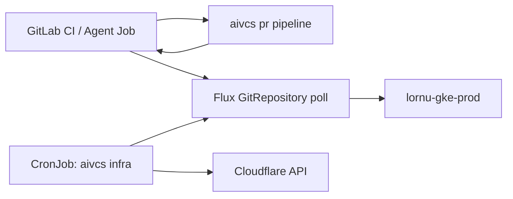

# Sovereign infra — GitLab + in-cluster reconcilers (no GitHub Actions)

Runbook for sunsetting GitHub as the automation plane for `lornu-ai`. Git stays
the source of truth; **Flux on `lornu-gke-prod`** applies it; **aivcs** opens
changes and runs reconcilers from Agent Jobs / CronJobs — not GHA.

## Architecture



| Layer | Tool | GitHub? |
|-------|------|--------|
| Git hosting | GitLab (`gitlab-container-builds`) | No |
| Change requests | `aivcs pr pipeline` → GitLab MR | No |
| Apply | Flux Kustomizations | No |
| CF LB hygiene | `aivcs infra cloudflare-lb` | No |
| Secrets | ESO → GSM / Key Vault | No |

## GitLab zero-touch pipeline

```bash
export AIVCS_GIT_HOST=gitlab
export GITLAB_TOKEN="$(cat /var/run/secrets/gitlab/token)"
export CI_PROJECT_PATH="lornu-ai/infra-code"   # or --owner/--repo

cargo run -p aivcs-cli -- pr pipeline \
  --branch chore/resume-cloudflare-lb-ks \
  --base develop \
  --owner lornu-ai \
  --repo infra-code \
  --path flux/kustomizations/ks-cloudflare-lb-aivcs-io.yaml \
  --file ./flux/kustomizations/ks-cloudflare-lb-aivcs-io.yaml \
  --message "chore: resume cloudflare-lb Flux KS" \
  --title "chore: resume cloudflare-lb KS" \
  --body "Automated by Sam — GitLab MR, no GHA" \
  --librarian=false
```

Merge the MR → Flux reconciles → ESO substitutes ConfigMaps. No laptop `gcloud auth`
required for operators; cluster ServiceAccounts use WIF.

## Cloudflare LB audit + prune (aks-lornu-hub)

Run **in-cluster** as a CronJob (mirror `ciso-agent-secret-scan` pattern):

```bash
export CF_API_TOKEN="$(kubectl get secret … -o jsonpath='{.data.CF_API_TOKEN}' | base64 -d)"
export CLOUDFLARE_ACCOUNT_ID=f1be33af27cf878e2e81cb29a0d886f7

# Detect orphans (exit 2 when drift found — wire to Better Stack / Sam)
aivcs infra cloudflare-lb audit \
  --allowlist policy/cloudflare-lb-allowlist.txt

# Delete unreferenced legacy pools (e.g. aks-lornu-hub)
aivcs infra cloudflare-lb prune \
  --allowlist policy/cloudflare-lb-allowlist.txt \
  --dry-run

aivcs infra cloudflare-lb prune \
  --allowlist policy/cloudflare-lb-allowlist.txt
```

Allowlist lives in git (`policy/cloudflare-lb-allowlist.txt`). Orphans with
`Random` steering and names like `aks-lornu-hub` are legacy AKS-hub ClickOps.

## Flux reconcile (resume suspended KS)

After MR merges ConfigMap / Kustomization changes:

```bash
export FLUX_CONTEXT=gke_gcp-lornu-ai_us-central1_lornu-gke-prod

aivcs infra flux reconcile \
  --kustomization cloudflare-lb-aivcs-io \
  --namespace flux-system \
  --with-source
```

## CronJob sketch (Flux-managed on gke-prod)

```yaml
apiVersion: batch/v1
kind: CronJob
metadata:
  name: aivcs-infra-cloudflare-lb-audit
  namespace: crossplane-system
spec:
  schedule: "0 6 * * *"
  jobTemplate:
    spec:
      template:
        spec:
          serviceAccountName: sre-agent
          restartPolicy: Never
          containers:
            - name: audit
              image: us-central1-docker.pkg.dev/gcp-lornu-ai/lornu/aivcs:0.3.2
              args:
                - infra
                - cloudflare-lb
                - audit
                - --allowlist
                - /policy/cloudflare-lb-allowlist.txt
              envFrom:
                - secretRef:
                    name: lornu-cluster-vars
```

Mount allowlist via ConfigMap. On exit code 2, Sam opens a GitLab MR via
`aivcs pr pipeline` to fix drift — closed loop, no GitHub.

## GitHub sunset checklist

1. Mirror repos to GitLab; point Flux `GitRepository` URLs at GitLab (OAuth / deploy token via ESO).
2. Move scheduled jobs from `.github/workflows/` to in-cluster CronJobs + `aivcs infra`.
3. Publish OCI via GitLab (`.gitlab-ci.yml`) + `aivcs oci publish` — see [oci-publish-gitlab.md](./oci-publish-gitlab.md).
4. Set `AIVCS_GIT_HOST=gitlab` in agent Job specs.
5. Retire `GITHUB_TOKEN` mounts where `GITLAB_TOKEN` replaces them.
6. Keep GitHub read-only mirror temporarily for external links only.

## Related

- [Zero-Touch PR Pipeline](./zero-touch-pr-pipeline.md)
- `lornu.ai/docs/FLUX_NATIVE_CI.md` — validation without GHA
- `policy/cloudflare-lb-allowlist.txt`
