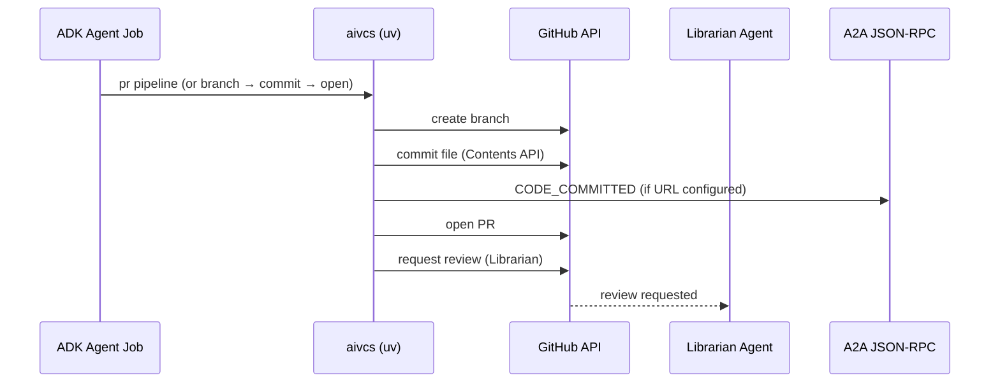

# Zero-Touch PR Pipeline

Epic: [stevedores-org/aivcs#191](https://github.com/stevedores-org/aivcs/issues/191)

Autonomous builder agents running in ephemeral ADK Jobs use `aivcs` (via `uv`) to branch, commit, open Pull Requests, and emit `CODE_COMMITTED` A2A events — without a local git checkout or human in the loop.

## Flow



## Single-command path

```bash
uv run aivcs pr pipeline \
  --branch "feat/my-change" \
  --base develop \
  --path docs/example.md \
  --file ./example.md \
  --message "docs: add example" \
  --title "feat: my change" \
  --body "Closes stevedores-org/aivcs#191" \
  --owner stevedores-org \
  --repo aivcs
```

Use `--skip-branch` when retrying after a partial run where the branch already exists.

## Step-by-step path

Same as the README GitHub Integration section:

1. `aivcs pr branch`
2. `aivcs pr commit` — emits `CODE_COMMITTED` when `AIVCS_A2A_JSONRPC_URL` is set
3. `aivcs pr open` — requests Librarian review by default

## Required environment

| Variable | Description |
|----------|-------------|
| `GITHUB_TOKEN` | GitHub App installation token (preferred). Projected by ESO from a Kubernetes Secret. |
| `GITHUB_TOKEN_FILE` | Alternative: path to a mounted token file (e.g. `/var/run/secrets/github/token`). Used when `GITHUB_TOKEN` is unset or whitespace-only. |
| `RELIC_LIBRARIAN_USERNAME` | GitHub username of the Librarian Agent. Required when `--librarian` is enabled (default). |
| `AIVCS_A2A_JSONRPC_URL` | JSON-RPC endpoint for A2A events. Absent ⇒ `CODE_COMMITTED` emission is skipped (no-op). |
| `AIVCS_AGENT_ID` | Authoring agent ID in the event payload. Falls back to a pipeline-specific default. |
| `AIVCS_JOB_ID` | Optional run correlation ID. |
| `GITHUB_REPOSITORY` | `owner/repo` for the `CODE_COMMITTED` payload. Set in CI/Jobs when no local git remote exists. |

## ESO + Workload Identity (task 2.2)

GitHub App tokens are minted by External Secrets Operator and projected into Agent Job pods. Until the crossplane-heaven GitHub App minter lands ([crossplane-heaven#6](https://github.com/stevedores-org/crossplane-heaven/issues/6)), mount the token as either:

- **`GITHUB_TOKEN`** — ESO `dataFrom` → env var, or
- **`GITHUB_TOKEN_FILE`** — secret volume mount at a stable path

`aivcs` reads `GITHUB_TOKEN` first, then falls back to the file.

## Librarian review

Every PR opened via `aivcs pr open` or `aivcs pr pipeline` requests review from the Librarian by default. Pass `--librarian=false` only in local dev or test contexts where the Librarian is not deployed.

## Related issues

- [#192](https://github.com/stevedores-org/aivcs/issues/192) — `CODE_COMMITTED` A2A event schema
- [crossplane-heaven#6](https://github.com/stevedores-org/crossplane-heaven/issues/6) — ESO GitHub App token minter
